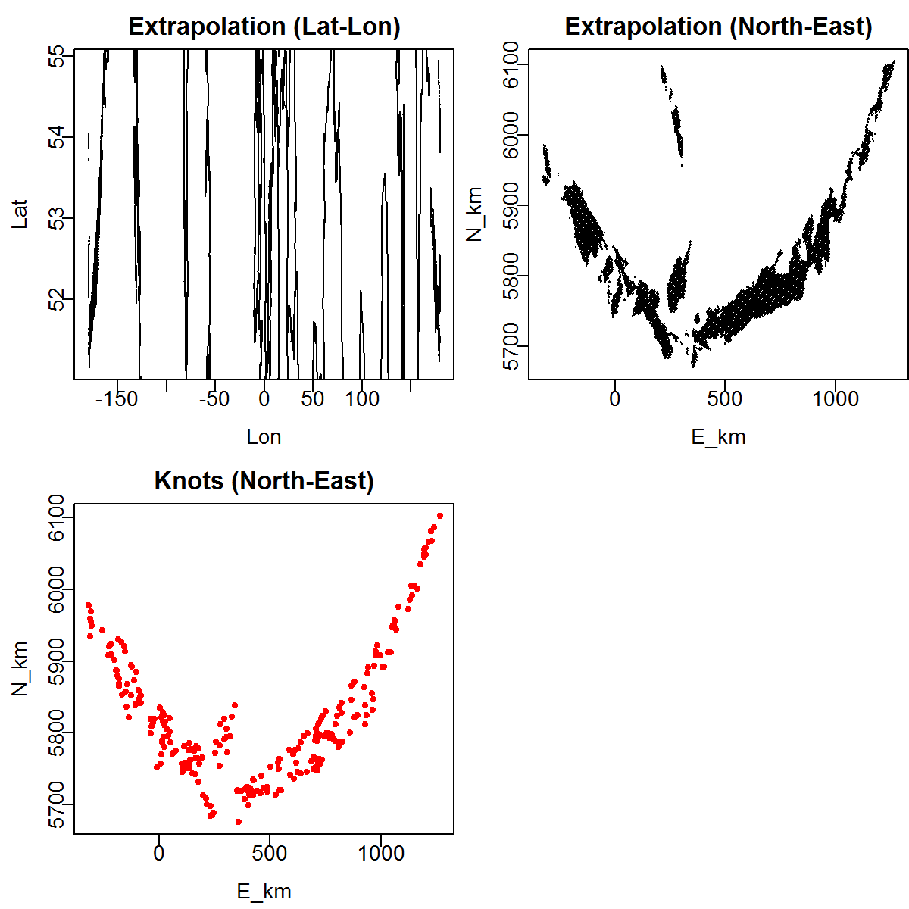
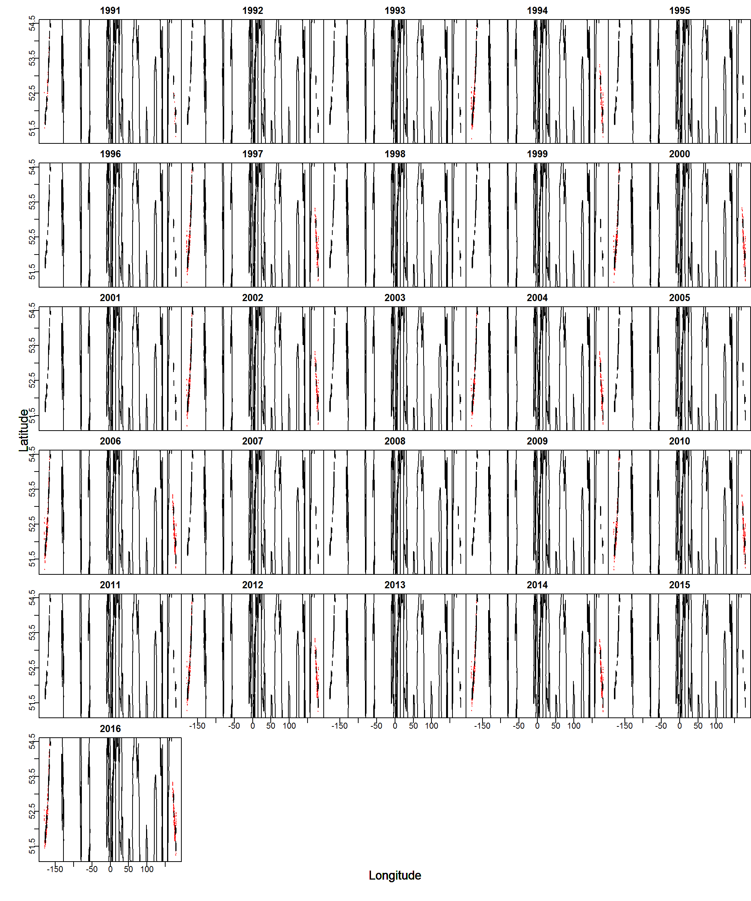
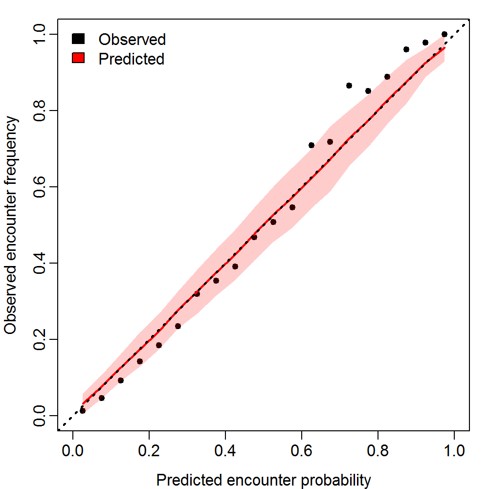
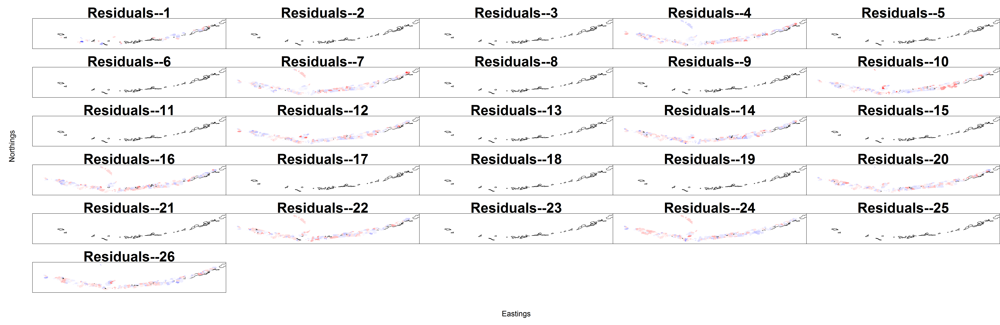
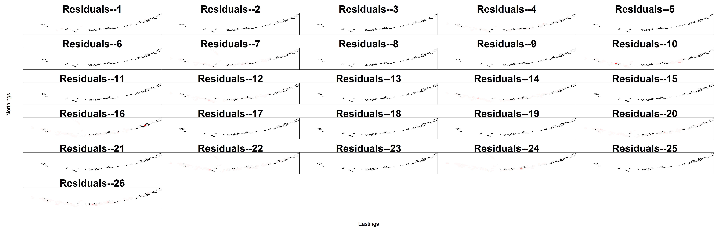
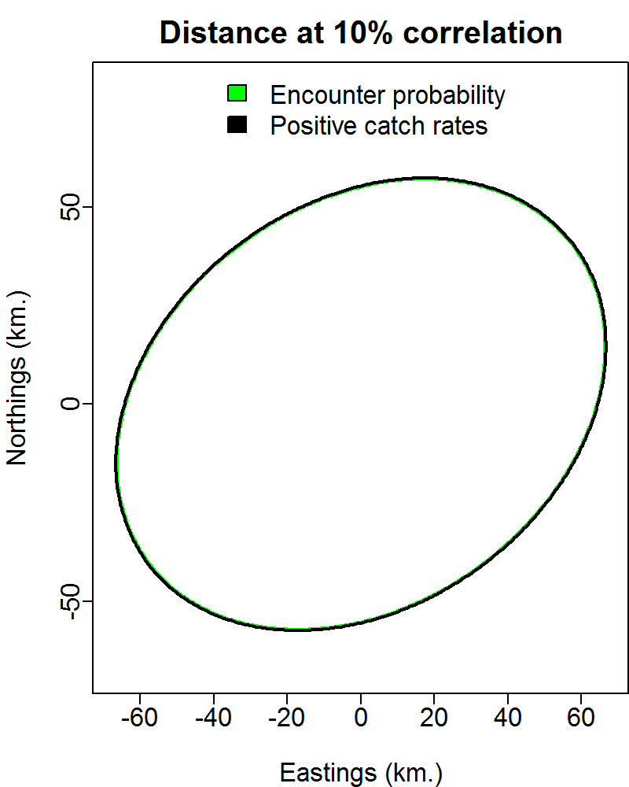
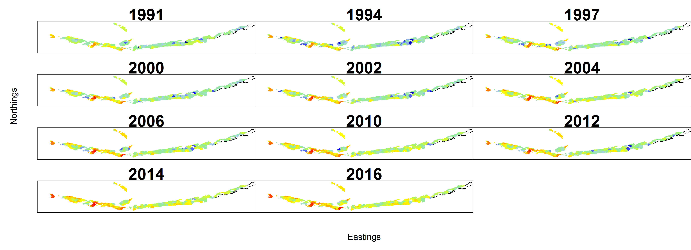
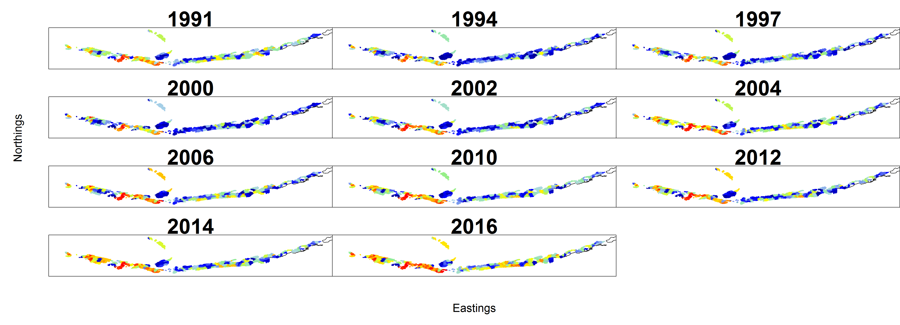
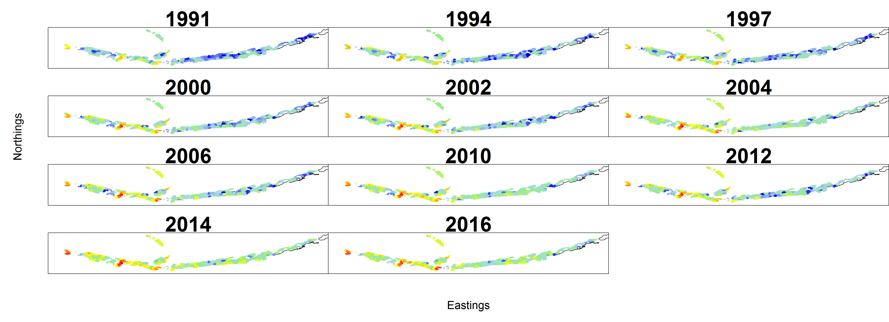
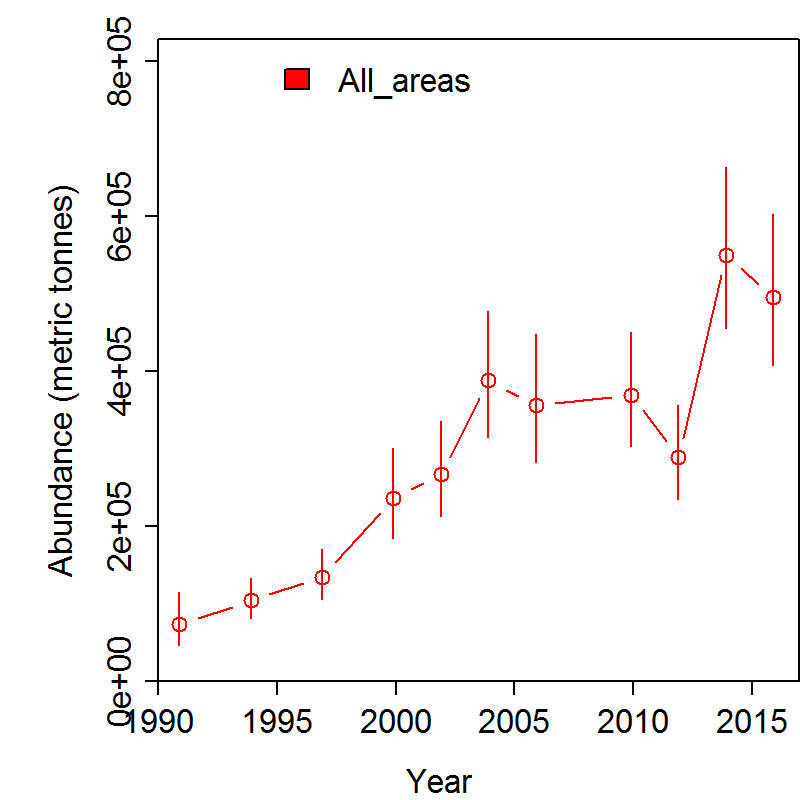

\newpage


```{r}
# clear the workspace before running code
rm(list=ls())
```


```{r setup,include=FALSE}
#install.packages("pander", repos="http://cran.us.r-project.org")
#install.packages("knitr", repos="http://cran.us.r-project.org")
#install.packages("kableExtra", repos="http://cran.us.r-project.org")
library(pander)
library(knitr)
library(kableExtra)

# knitr::opts_chunk$set(cache=TRUE)
options(width=50, width.cutoff=50)#, digits = 3) 
```

```{r}
# clean the cache
clean_cache(clean = FALSE, path = opts_chunk$get("cache.path"))
```

```{r wrap-hook, echo=FALSE}
# FROM: https://github.com/yihui/knitr-examples/blob/master/077-wrap-output.Rmd
library(knitr)
hook_output = knit_hooks$get('output')
knit_hooks$set(output = function(x, options) {
  # this hook is used only when the linewidth option is not NULL
  if (!is.null(n <- options$linewidth)) {
    x = knitr:::split_lines(x)
    # any lines wider than n should be wrapped
    if (any(nchar(x) > n)) x = strwrap(x, width = n)
    x = paste(x, collapse = '\n')
  }
  hook_output(x, options)
})
# TRIGGERED USING `linewidth=60`
```


#Purpose
The purpose of this document is to describe how to generate a model-based index of abundance using the spatio-temporal delta-GLMM in the [VAST](https://github.com/James-Thorson/VAST) package. This model uses habitat covariates to produce the index.

Specifics of this Example:

* Uses [RACE](https://www.afsc.noaa.gov/RACE/groundfish/bottom%20trawl%20surveys.php) bottom trawl survey data.
    +  Data are available from the [/data](https://github.com/curryc2/AFSC_Spatio-temporal_Workshop/tree/master/data) folder
* Single species implementation.
* Aleutian Islands survey data.
* Uses depth, temperature, slope, maximum tidal current, longitude and ROMS bottom currents as 
linear covariates in the model (see Turner et al. 2017 for details on habitat variables)

#Setup

##Install required packages
```{r load_packages, message=FALSE}
# devtools::install_github("nwfsc-assess/geostatistical_delta-GLMM") 
# devtools::install_github("james-thorson/VAST") 
# devtools::install_github("james-thorson/utilities")
# install.packages("dplyr", repos="http://cran.us.r-project.org")
```

##Load required packages

```{r, warning=FALSE, message=FALSE}
library(dplyr)
library(VAST)
library(TMB)
library(raster)
library(rgdal)
library(maptools)
library(gstat)
library(rgeos)
library(proj4)
library(sp)
library(maps)
library(devtools)
library(ggplot2)
library(pander)
library(mgcv)
library(MEHRSI)
library(randomForest)
devtools::install_github("rooperc4/GLMGAMRF")
library("GLMGAMRF")
devtools::install_github("rooperc4/HISAVAST")
library(HISAVAST)
# libary(tidyverse)
```

***
##Setup model
###Define species of interest (based on species code) and survey name. In this case we have chosen Northern Rockfish (species code = 30420)

```{r}
#Species for AI model comparison: pop (30060), nrf(30420), atf(10110), hal(10120), pcod(21720), atka(21921)
species.codes<-c(30420)
species.names<-c("Northern Rockfish")
survey = "AI"
```

`survey` variable specifications include the Eastern Bering Sea shelf survey `"EBS_SHELF"`, Gulf of Alaska survey `"GOA"`, and the Aleutian Islands survey `"AI"`.

Next, we will define the `Region`, for spatial extrapolation.

```{r}
if(survey=="GOA") { Region = 'Gulf_of_Alaska' }
if(survey=="EBS_SHELF") { Region = "Eastern_Bering_Sea" }
if(survey=="AI") { Region = "Aleutian_Islands" }
```

###Spatial settings
The following settings define the spatial resolution for the model (defined by number of knots `n_x`), and whether to use a grid or mesh approximation through the `Method` variable.

```{r}
Method = c("Grid", "Mesh", "Spherical_mesh")[2]
grid_size_km = 25
n_x = c(100, 250, 500, 1000, 2000)[2]
Kmeans_Config = list( "randomseed"=1, "nstart"=100, "iter.max"=1e3 )
```

###Define strata limits
Here we can define the latitude and longitude designations for strata, if strata-specific indices are desired. We will not stratify in this example.

```{r}
#Basic - Single Area
strata.limits = data.frame(STRATA = c("All_areas"))
```

###VAST version settings
Define which version of [VAST](https://github.com/James-Thorson/VAST) you will be using, i.e. which version of CPP code will be referenced for the [TMB](https://github.com/kaskr/adcomp) model.

```{r}
Version = "VAST_v4_2_0"
```

###Model settings
**Bias correction**

Define whether to implement epsilon bias correction estimator for nonlinear transformation of random effects, through the `bias.correct` variable. See [Thorson and Kristensen (2016)](https://www.sciencedirect.com/science/article/pii/S0165783615301399)

*Note: Bias correction is computationally intensive, especially for models with high spatial complexity i.e. high `n_x`.

```{r}
bias.correct = FALSE
```

**Spatio-temporal variation, autocorrelation, and overdispersion**

The following settings define whether to include spatial and spatio-temporal variation (`FieldConfig`), whether its autocorre- lated (`RhoConfig`), and whether there’s overdispersion (`OverdispersionConfig`).
In `FieldConfig`, `Omega1` and `Omega2` are `ON/OFF = 1/0` switches for spatial random effects in the **(1)** positive catch rate and **(2)** encounter probability components of the delta model. `Epsilon1` and `Epsilon2` are ON/OFF switches for the spatio-temporal random effects.
In `RhoConfig`, `Beta1` and `Beta2` are autocorrelation specifications for intercepts, while `Epsilon1` and `Epsilon2` are the same specifications for spatio-temporal random effects, for **(1)** positive catch rate and **(2)** encounter probability components of the delta model.

```{r configure model}
FieldConfig = c(Omega1 = 1, Epsilon1 = 1, Omega2 = 1, Epsilon2 = 1)
RhoConfig  = c(Beta1 = 0, Beta2 = 0, Epsilon1 = 0, Epsilon2 = 0)
OverdispersionConfig  = c(Delta1 = 0, Delta2 = 0)
```

###Observation model settings
The `ObsModel` vector is used to specify the assumed observation model, where **first** element specifies the distribution for **positive catch rates** and **second** element specifies the functional form for **encounter probabilities**.
Here we specify the conventional delta-model using logit-link for encounter probability and log-link for positive catch rates.
```{r}
ObsModel = c(1,0)
```

**Alternatives:**

`ObsModel` **Specification** | Distribution for **Positive Catch Rates**
-----------------------------|--------------------------------------------
`ObsModel[1]=0`   | Normal
`ObsModel[1]=1`   | Lognormal
`ObsModel[1]=2`   | Gamma
`ObsModel[1]=5`   | Negative binomial
`ObsModel[1]=6`   | Conway-Maxwell-Poisson (likely to be very slow)
`ObsModel[1]=7`   | Poisson (more numerically stable than negative-binomial)
`ObsModel[1]=8`   | Compound-Poisson-Gamma, where the expected number of individuals is the 1st-component, the expected biomass per individual is the 2nd-component, and SigmaM is the variance in positive catches (likely to be very slow)
`ObsModel[1]=9`   | Binned-Poisson (for use with REEF data, where 0=0 individual; 1=1 individual; 2=2:10 individuals; 3=>10 individuals)
`ObsModel[1]=10`   | Tweedie distribution, where epected biomass (lambda) is the product of 1st-component and 2nd-component, variance scalar (phi) is the 1st component, and logis-SigmaM is the power

*See documentation for `Data_Fn()` within VAST for specification of `ObsModel`.

###Save settings
**DateFile** is the folder that will hold my model outputs.

```{r, warning=FALSE}

DateFile = paste0(getwd(), "/AI_VAST_output_hab_NRF/")

#delete previous output directories
unlink("AI_VAST_output_hab_NRF", recursive=TRUE)
#do.call(file.remove, list(list.files("AI_VAST_output_hab_NRF", full.names = TRUE)))

#Create directory
dir.create(DateFile, recursive=TRUE)
```

***
##Specify model outputs
The following settings define what types of output we want to calculate.

```{r}
Options = c(SD_site_density = 0
            , SD_site_logdensity = 0
            , Calculate_Range = 1
            , Calculate_evenness = 0
            , Calculate_effective_area = 1
            , Calculate_Cov_SE = 0
            , Calculate_Synchrony = 0
            , Calculate_Coherence = 0)
```

***
#Prepare the data

##Load RACE data
To create the input data files for VAST model, first we must load RACE survey data. In this case we have already downloaded flat files from RACEBASE using sql server. This step can also be accomplished using RODBC and sequel scripts.
Two data files are necessary **(1)** haul data and **(2)** catch data.

**Haul data**

```{r}
#haul = read.csv("\\\\AKC0SS-N086/RACE_Users/chris.rooper/Desktop/HAIP Project - Survey Modeling Methods/VAST/HISAdata/HISA_haul_sql.csv")

data("haul")

#for each column, how much data is missing
apply(haul, 2, function(x) sum(is.na(x)))

# List the unique cruise numbers
sort(unique(haul$CRUISE))
```

### For habitat covariates we will use depth, temperature, invertebrate catch, slope, maximum tidal current (tmax) and bottom currents predicted by a ROMS model (Danielson et al. 2011). Depth, temperature, and invertebrate catch are all recorded at the time of the tow, the other variables are taken from raster layers created ala Laman et al. (2017). To do the extraction we first calculate the midpoint of each survey tow (accounting for its position behind the vessel) and then import the raster layers and extract the data for each haul at the midpoint of the tow. The raster layers can be found on https://github.com/rooperc4/HISAVAST/AI_rasters and https://github.com/rooperc4/HISAVAST/GOA_rasters. These files need to be copied to your working directory. 

```{r}
# create new columns for longitude and latitude and calculate the midpoint of the tow and
# spatially transpose them to Alaska Albers projection

haul.pos<-NetPosition(haul$START_LATITUDE, haul$END_LATITUDE, haul$START_LONGITUDE, haul$END_LONGITUDE, haul$WIRE_LENGTH, haul$BOTTOM_DEPTH)
haul$LONGITUDE<-(haul.pos[,3]+haul.pos[,4])/2
haul$LATITUDE<-(haul.pos[,1]+haul.pos[,2])/2
points.project <- project(cbind(haul$LONGITUDE,haul$LATITUDE), "+proj=aea +lat_1=55 +lat_2=65 +lat_0=50 +lon_0=-154 +x_0=0 +y_0=0 +ellps=GRS80 +datum=NAD83 +units=m +no_defs")


# bring in environmental layers

AIslope<-raster("./AI_rasters/Slope")
GOAslope<-raster("./GOA_rasters/Slope")
AItmax<-raster("./AI_rasters/Tmax")
GOAtmax<-raster("./GOA_rasters/Tmax")
AIbcurrent<-raster("./AI_rasters/Bcurrent")
GOAbcurrent<-raster("./GOA_rasters/Bcurrent")
AIstack<-stack(AIslope,AItmax,AIbcurrent)
GOAstack<-stack(GOAslope,GOAtmax,GOAbcurrent)

#Extract the data at each haul midpoint

AIraster.data <- as.data.frame(raster::extract(AIstack, points.project))
GOAraster.data <- as.data.frame(raster::extract(GOAstack, points.project))
GOAraster.data <- cbind(haul$HAULJOIN, GOAraster.data)
colnames(GOAraster.data) <- c("HAULJOIN", "Slope", "Tmax", "Bcurrent")
GOAraster.data <- subset(GOAraster.data, is.na(GOAraster.data$Slope)==FALSE)
AIraster.data <- cbind(haul$HAULJOIN, AIraster.data)
colnames(AIraster.data) <- c("HAULJOIN", "Slope", "Tmax", "Bcurrent")
AIraster.data <- subset(AIraster.data, is.na(AIraster.data$Slope)==FALSE)
raster.data <- rbind(GOAraster.data, AIraster.data)

#remove duplicates that fell on both rasters
raster.data<-raster.data[!duplicated(raster.data$HAULJOIN),]

#merge the data with the existing haul information

haul.1<-merge(haul, raster.data, by = "HAULJOIN", all.x = TRUE)

#remove rows with NA for evironmental variables
haul.1 <- haul.1[!is.na(haul.1$GEAR_TEMPERATURE) & !is.na(haul.1$Slope) & !is.na(haul.1$Tmax) & !is.na(haul.1$BOTTOM_DEPTH), ]# 

#for each column, how much data is missing
apply(haul.1, 2, function(x) sum(is.na(x)))

```

Lets see what `haul.1` contains...

```{r}
names(haul.1)

```

Limit haul dataset to only abundance hauls

```{r}
haul.1 = haul.1[haul.1$ABUNDANCE_HAUL=='Y',]
```


**Catch data**

```{r}
data("catch")
#catch = read.csv("//AKC0SS-N086/RACE_Users/chris.rooper/Desktop/HAIP Project - Survey Modeling Methods/VAST/HISADATA/HISA_catch_sql.csv")
#catch <- dplyr::filter(catch, CRUISE > 199101)
sort(unique(catch$CRUISE))
```


Lets see what `catch` contains...

```{r}
names(catch)
```

Next we subset the catch records for the weight (kg) catch of the species of interest.

```{r}
catch.1<-subset(catch,catch$SPECIES_CODE==species.codes)
catch.1<-data.frame(HAULJOIN=catch.1$HAULJOIN,WEIGHT=catch.1$WEIGHT)
head(catch.1)
```

A final habitat covariate we will use is the abundance of benthic invertebrates captured
in each bottom trawl haul. Here we will collate the invertebrate data by species group from 
RACEBASE and sum the catches (kg) to obtain a total catch for invertebrate structure.

```{r}
##############################################################################################
##############INVERTEBRATES###################################################################
catch.data<-catch
#black corals
black_coral<-subset(catch.data,catch.data$SPECIES_CODE>=41525&catch.data$SPECIES_CODE<=41553)
black_coral<-aggregate(black_coral$WEIGHT, by=list(black_coral$HAULJOIN), FUN=sum)
colnames(black_coral)<-c("HAULJOIN","black_coral")

#sea pens
penn<-subset(catch.data, catch.data$SPECIES_CODE>=42000&catch.data$SPECIES_CODE<=42021)
penn<-aggregate(penn$WEIGHT, by=list(penn$HAULJOIN), FUN=sum)
colnames(penn)<-c("HAULJOIN","penn")

#alcyonacea
alcyonacea<-subset(catch.data,(catch.data$SPECIES_CODE>=41000&catch.data$SPECIES_CODE<=41523)|
	(catch.data$SPECIES_CODE>=41570&catch.data$SPECIES_CODE<=41752)|
	(catch.data$SPECIES_CODE>=44065&catch.data$SPECIES_CODE<=44075)|
	(catch.data$SPECIES_CODE>=44083&catch.data$SPECIES_CODE<=44115))
alcyonacea<-aggregate(alcyonacea$WEIGHT, by=list(alcyonacea$HAULJOIN), FUN=sum)
colnames(alcyonacea)<-c("HAULJOIN","alcyonacea")

#Scleractinia
scleractinia<-subset(catch.data,catch.data$SPECIES_CODE>=44000&catch.data$SPECIES_CODE<=44023)
scleractinia<-aggregate(scleractinia$WEIGHT,by=list(scleractinia$HAULJOIN),FUN=sum)
colnames(scleractinia)<-c("HAULJOIN","scleractinia")


#Demosponges
demosponge<-subset(catch.data,(catch.data$SPECIES_CODE>=91000&catch.data$SPECIES_CODE<=91020)|
	(catch.data$SPECIES_CODE>=91038&catch.data$SPECIES_CODE<=91047)|
	(catch.data$SPECIES_CODE>=91049&catch.data$SPECIES_CODE<=91051)|
	(catch.data$SPECIES_CODE>=91054&catch.data$SPECIES_CODE<=91069)|
	(catch.data$SPECIES_CODE>=91071&catch.data$SPECIES_CODE<=91084)|catch.data$SPECIES_CODE==91086|
	(catch.data$SPECIES_CODE>=91088&catch.data$SPECIES_CODE<=91096)|
	(catch.data$SPECIES_CODE>=91098&catch.data$SPECIES_CODE<=91102)|
	(catch.data$SPECIES_CODE>=91105&catch.data$SPECIES_CODE<=91272)|
	(catch.data$SPECIES_CODE>=91704&catch.data$SPECIES_CODE<=91705)|
	(catch.data$SPECIES_CODE>=91995&catch.data$SPECIES_CODE<=91998)|
	(catch.data$SPECIES_CODE>=99981&catch.data$SPECIES_CODE<=99988))
demosponge<-aggregate(demosponge$WEIGHT,by=list(demosponge$HAULJOIN),FUN=sum)
colnames(demosponge)<-c("HAULJOIN","demosponge")

#Glass sponges
glass<-subset(catch.data,(catch.data$SPECIES_CODE>=91030&catch.data$SPECIES_CODE<=91020)|
	catch.data$SPECIES_CODE==91048|catch.data$SPECIES_CODE==91053|catch.data$SPECIES_CODE==91070|
	(catch.data$SPECIES_CODE>=91103&catch.data$SPECIES_CODE<=91104)|
	(catch.data$SPECIES_CODE>=91700&catch.data$SPECIES_CODE<=91701)|
	(catch.data$SPECIES_CODE>=91710&catch.data$SPECIES_CODE<=91725))
glass<-aggregate(glass$WEIGHT,by=list(glass$HAULJOIN),FUN=sum)
colnames(glass)<-c("HAULJOIN","glass")

invert_data<-data.frame(HAULJOIN=haul.1[,1])
invert_data<-merge(invert_data, black_coral, by="HAULJOIN", all.x=TRUE)
invert_data<-merge(invert_data, penn, by="HAULJOIN", all.x=TRUE)
invert_data<-merge(invert_data, alcyonacea, by="HAULJOIN", all.x=TRUE)
invert_data<-merge(invert_data, scleractinia, by="HAULJOIN", all.x=TRUE)
invert_data<-merge(invert_data, demosponge, by="HAULJOIN", all.x=TRUE)
invert_data<-merge(invert_data, glass, by="HAULJOIN", all.x=TRUE)
invert_data[is.na(invert_data)]<-0
invert_data$Coral<-invert_data$black_coral+invert_data$alcyonacea+invert_data$scleractinia
invert_data$Sponge<-invert_data$demosponge+invert_data$glass
invert_data$Penn<-invert_data$penn
# invert_data$Sponge[invert_data$Sponge>0]<-1
# invert_data$Coral[invert_data$Coral>0]<-1
# invert_data$Penn[invert_data$Penn>0]<-1
invert_data<-invert_data[,-(2:7)]

Inverts <- invert_data %>%
  mutate(Inverts = invert_data$Coral + invert_data$Sponge + invert_data$Penn)
Inverts <- Inverts[,c(1,5)]
#unique(Inverts$Inverts)
```

###Join datasets
We need to join haul information to catch data, creating list `catchhaul`. Also need to zero fill the data for each haul with no catch of the specie sof interest.

```{r}
catchhaul<-merge(haul.1,Inverts,by="HAULJOIN",all.x=TRUE)
catchhaul = merge(catchhaul,catch.1,by="HAULJOIN",all.x=TRUE)
head(catchhaul)
catchhaul$WEIGHT[is.na(catchhaul$WEIGHT)]<-0

```

### Calculate CPUE for invertebrate data and log transform invert data. Here we have estimated area swept in hectares.

```{r}
catchhaul$AREA_SWEPT<-catchhaul$DISTANCE_FISHED*1000*catchhaul$NET_WIDTH/10000
catchhaul$Inverts<-catchhaul$Inverts/catchhaul$AREA_SWEPT
catchhaul$WEIGHT_CPUE<-catchhaul$WEIGHT/catchhaul$AREA_SWEPT
catchhaul$lnInverts<-log(catchhaul$Inverts + 0.5*min(subset(catchhaul$Inverts, catchhaul$Inverts>0)))

```

###Attach year info

```{r}
catchhaul$Year<-round(catchhaul$CRUISE/100,0)
```


####Limit to survey of interest
We need to limit our dataset to only the survey of interest and add the common name for the species.

```{r}
catchhaul<-catchhaul[catchhaul$REGION==survey,]
catchhaul$Common.Name<-species.names
```


##Build `Data_Geostat`
Now, we will create the list `Data_Geostat` which is the input for the VAST model. Here I have renamed the dataset to match Curry's input data.

```{r}
load.data<-catchhaul
Data_Geostat = NULL
```

###Add elements to `Data_Geostat` list
If you are running for multiple species add the species name.

```{r}
if(length(species.codes) > 1) {
  Data_Geostat$spp = load.data$Common.Name
}
Data_Geostat$Catch_KG = as.numeric(load.data$WEIGHT)
Data_Geostat$Year = as.integer(load.data$Year)
Data_Geostat$Vessel = "missing"
Data_Geostat$AreaSwept_km = as.numeric(load.data$AREA_SWEPT*.01)
Data_Geostat$Pass = 0
``` 


###Define location of samples
Here we are using the corrected midpoint of the haul as the location of the samples. You could also use the start or end points.

```{r}
  Data_Geostat$Lat = load.data$LATITUDE
  Data_Geostat$Lon = load.data$LONGITUDE

```


Finally, we must ensure this `Data_Geostat` is a proper data frame.

```{r}
Data_Geostat = data.frame(Data_Geostat)
```


To double check lets see how `Data_Geostat` looks...

```{r, include=TRUE}
kable(head(Data_Geostat))
```

##Create the extrapolation grid
We also generate the extrapolation grid appropriate for a given region. For new regions, we use Region="Other".

* Note: We are not defining strata limits, but could do so based on latitude and longitude definitions.

```{r, message=FALSE, tidy=TRUE, linewidth=60}
Extrapolation_List  = SpatialDeltaGLMM::Prepare_Extrapolation_Data_Fn(Region = Region,
                                                                         strata.limits = strata.limits)

```


##Create spatial list
Next, generate the information used for conducting spatio-temporal parameter estimation, bundled in list `Spatial_List`.

```{r spatial_information, message=FALSE, warning=FALSE, tidy=TRUE, linewidth=60}
library(SpatialDeltaGLMM)
Spatial_List = SpatialDeltaGLMM::Spatial_Information_Fn(grid_size_km = grid_size_km
                                                        , n_x = n_x, Method = Method
                                                        , Lon = Data_Geostat[,"Lon"]
                                                        , Lat = Data_Geostat[, "Lat"]
                                                        , Extrapolation_List = Extrapolation_List
                                                        , randomseed = Kmeans_Config[["randomseed"]]
                                                        , nstart = Kmeans_Config[["nstart"]]
                                                        , iter.max = Kmeans_Config[["iter.max"]]
                                                        , DirPath = DateFile
                                                        , Save_Results = TRUE)
```


##Update `Data_Geostat` with knot references
We then associate each of our haul observations with its appropriate knot.

```{r}
Data_Geostat = cbind(Data_Geostat, knot_i = Spatial_List$knot_i)
```

## Now we add in covariates in a 3 dimensional matrix with the mean value for each associated knot. This section can be skipped if habitat covariates are not used.

```{r}
xvars<-c("lnInverts","Slope","Tmax","GEAR_TEMPERATURE","BOTTOM_DEPTH")
yrs<-seq(min(Data_Geostat[,"Year"]),max(Data_Geostat[,"Year"]),1)
yrs2<-unique(Data_Geostat$Year)
yrs<-subset(yrs,!(yrs%in%yrs2))
knots2<-unique(Data_Geostat$knot_i)
xes<-data.frame(Year=load.data$Year,knot_i=Spatial_List$knot_i,lnInverts=load.data$lnInverts,Slope=load.data$Slope,Tmax=load.data$Tmax,GEAR_TEMPERATURE=load.data$GEAR_TEMPERATURE,BOTTOM_DEPTH=load.data$BOTTOM_DEPTH)
xes2<-data.frame(Year=rep(yrs, each=length(knots2)),knot_i=knots2,lnInverts=mean(load.data$lnInverts),Slope=mean(load.data$Slope),Tmax=mean(load.data$Tmax),GEAR_TEMPERATURE=mean(load.data$GEAR_TEMPERATURE),BOTTOM_DEPTH=mean(load.data$BOTTOM_DEPTH))
xes<-rbind(xes,xes2)
xes<-xes[order(xes$Year,xes$knot_i),]
x_matrix<-array(dim=c(length(unique(Spatial_List$knot_i)),length(unique(xes$Year)),length(xvars)))

x_matrix[,,1]<-with(xes,tapply(lnInverts,list(knot_i,Year),mean,na.rm=TRUE))
x_matrix[,,1][is.na(x_matrix[,,1])]<-mean(x_matrix[,,1],na.rm=TRUE)
x_matrix[,,2]<-with(xes,tapply(Slope,list(knot_i,Year),mean,na.rm=TRUE))
x_matrix[,,2][is.na(x_matrix[,,2])]<-mean(x_matrix[,,2],na.rm=TRUE)
x_matrix[,,3]<-with(xes,tapply(Tmax,list(knot_i,Year),mean,na.rm=TRUE))
x_matrix[,,3][is.na(x_matrix[,,3])]<-mean(x_matrix[,,3],na.rm=TRUE)
x_matrix[,,4]<-with(xes,tapply(GEAR_TEMPERATURE,list(knot_i,Year),mean,na.rm=TRUE))
x_matrix[,,4][is.na(x_matrix[,,4])]<-mean(x_matrix[,,4],na.rm=TRUE)
x_matrix[,,5]<-with(xes,tapply(BOTTOM_DEPTH,list(knot_i,Year),mean,na.rm=TRUE))
x_matrix[,,5][is.na(x_matrix[,,5])]<-mean(x_matrix[,,5],na.rm=TRUE)


Data_Geostat<-Data_Geostat[order(Data_Geostat$Year,Data_Geostat$knot_i),]
#head(Data_Geostat)
```


***
#Build and run model
##Build model
To estimate parameters, we first build a list of data-inputs used for parameter estimation. Data_Fn has some simple checks for buggy inputs, but also please read the help file ?Data_Fn.

```{r, message=FALSE, tidy=TRUE, cache = TRUE}
  #SINGLE SPECIES
  TmbData = VAST::Data_Fn(Version = Version, FieldConfig = FieldConfig
                    , OverdispersionConfig = OverdispersionConfig
                    , RhoConfig = RhoConfig
                    , ObsModel = ObsModel
                    , c_i = rep(0, nrow(Data_Geostat))
                    , b_i = Data_Geostat[, "Catch_KG"]
                    , a_i = Data_Geostat[,"AreaSwept_km"]
                    , X_xtp=x_matrix
                    , v_i = as.numeric(Data_Geostat[,"Vessel"]) - 1
                    , s_i = Data_Geostat[, "knot_i"] - 1
                    , t_i = Data_Geostat[, "Year"]
                    , a_xl = Spatial_List$a_xl
                    , MeshList = Spatial_List$MeshList
                    , GridList = Spatial_List$GridList
                    , Method = Spatial_List$Method
                    , Options = Options)

```

##Build TMB object
Next, we build and compile the TMB object for estimation.

* Note: Compilation may take some time... **be patient**. 

```{r, message=FALSE, results="hide", tidy=TRUE, cache = TRUE}
TmbList = VAST::Build_TMB_Fn(TmbData = TmbData, RunDir = DateFile
                                , Version = Version, RhoConfig = RhoConfig, loc_x = Spatial_List$loc_x
                                , Method = Method)
Obj = TmbList[["Obj"]]
```

###Do estimation
Fit VAST model to the data by optimizing the TMB function.

```{r, results="hide", cache=TRUE}
Opt = TMBhelper::Optimize(obj = Obj, lower = TmbList[["Lower"]]
                          , upper = TmbList[["Upper"]], getsd = TRUE, savedir = DateFile
                          , bias.correct = bias.correct, newtonsteps = 2)
```

###Save output
Save outputs from estimation

```{r}
Report = Obj$report()

Save = list("Opt"=Opt, "Report"=Report, "ParHat"=Obj$env$parList(Opt$par), 
            "TmbData"=TmbData)

save(Save, file=paste0(DateFile,"Save.RData"))
```

#Diagnostic plots

We first apply a set of standard model diagnostics to confirm that the model is reasonable and deserves further attention.  If any of these do not look reasonable, the model output should not be interpreted or used.

##Plot data

It is always good practice to conduct exploratory analysis of data.  Here, I visualize the spatial distribution of data.  Spatio-temporal models involve the assumption that the probability of sampling a given location is statistically independent of the probability distribution for the response at that location.  So if sampling "follows" changes in density, then the model is probably not appropriate!

```{r explore_data, results="hide", tidy=TRUE, message=FALSE, warning=FALSE}
SpatialDeltaGLMM::Plot_data_and_knots(Extrapolation_List=Extrapolation_List
                                      , Spatial_List=Spatial_List
                                      , Data_Geostat=Data_Geostat
                                      , PlotDir=DateFile )
```



 

\newpage

##Convergence
Here we print the diagnostics generated during parameter estimation, and confirm that (1) no parameter is hitting an upper or lower bound and (2) the final gradient for each fixed-effect is close to zero. For explanation of parameters, please see `?Data_Fn`.

```{r print_results, results="asis"}
pander::pandoc.table( Opt$diagnostics[,c('Param','Lower','MLE','Upper','final_gradient')] )
```
## Diagnostics for encounter-probability component

Next, we check whether observed encounter frequencies for either low or high probability samples are within the 95% predictive interval for predicted encounter probability
```{r diagnostics_encounter_prob, results="hide", eval=TRUE, tidy=TRUE, linewidth=50}
Enc_prob = SpatialDeltaGLMM::Check_encounter_prob( Report=Report, Data_Geostat=Data_Geostat, DirName=DateFile)
```

\newpage

##Diagnostics for positive-catch-rate component

We can visualize fit to residuals of catch-rates given encounters using a Q-Q plot.  A good Q-Q plot will have residuals along the one-to-one line.

* Note: In this plot, the red line should fall along the 1:1 line.

```{r plot_QQ, eval=TRUE, tidy=TRUE, linewidth=50, message=FALSE, warning=FALSE}
Q = SpatialDeltaGLMM::QQ_Fn( TmbData = TmbData, Report = Report
                             , FileName_PP = jpeg(paste0(DateFile,"Posterior_Predictive.jpg"))
                             , FileName_Phist = jpeg(paste0(DateFile,"Posterior_Predictive_Histogram.jpg"))
                             , FileName_QQ = jpeg(paste0(DateFile,"Q-Q_plot.jpg"))
                             , FileName_Qhist = jpeg(paste0(DateFile,"QQ_hist.jpg"))) 
```


\newpage

##Diagnostics for plotting residuals on a map

Finally, we visualize residuals on a map.  To do so, we first define years to plot and generate plotting inputs.
useful plots by first determining which years to plot (`Years2Include`), and labels for each plotted year (`Year_Set`).
Some general insights:

* `MapDetails_Fn` - Tries to automatically detect size of plots to do, determine what states to plot nearby.
* `Year_Set` - Range of years sampled (bookeeping)
* `Years2Include` - Years with surveys (bookeeping)

```{r plot_years}
# Get region-specific settings for plots
MapDetails_List = SpatialDeltaGLMM::MapDetails_Fn( "Region" = Region,
                                                   "NN_Extrap" = Spatial_List$PolygonList$NN_Extrap,
                                                   "Extrapolation_List" = Extrapolation_List )
# Decide which years to plot
Year_Set = seq(min(Data_Geostat[,'Year']),max(Data_Geostat[,'Year']))
Years2Include = which( Year_Set %in% sort(unique(Data_Geostat[,'Year'])))
```

We then plot Pearson residuals.  If there are visible patterns (areas with consistently positive or negative residuals accross or within years) then this is an indication of the model "overshrinking" results towards the intercept, and model results should then be treated with caution.

```{r plot_pearson_resid, message=FALSE, warning=FALSE, tidy=TRUE, linewidth=50}
SpatialDeltaGLMM:::plot_residuals(Lat_i = Data_Geostat[,"Lat"]
                                  , Lon_i = Data_Geostat[, "Lon"]
                                  , TmbData = TmbData
                                  , Report = Report
                                  , Q = Q
                                  , savedir = DateFile
                                  , MappingDetails = MapDetails_List[["MappingDetails"]]
                                  , PlotDF = MapDetails_List[["PlotDF"]]
                                  , MapSizeRatio = MapDetails_List[["MapSizeRatio"]]
                                  , Xlim = MapDetails_List[["Xlim"]]
                                  , Ylim = MapDetails_List[["Ylim"]]
                                  , FileName = DateFile
                                  , Year_Set = Year_Set 
                                  , Rotate = MapDetails_List[["Rotate"]]
                                  , Cex = MapDetails_List[["Cex"]]
                                  , Legend = MapDetails_List[["Legend"]]
                                  , zone = MapDetails_List[["Zone"]]
                                  , mar = c(0, 0, 2, 0), oma = c(3.5, 3.5, 0, 0), cex = 1.8)
```

**Encounter Probability Residuals**



**Catch Rate Residuals**



\newpage

## Model selection

To select among models, we recommend using the Akaike Information Criterion, AIC, via `Opt$AIC=` ``r Opt$AIC``.

# Model output

Last but not least, we generate pre-defined plots for visualizing results

## Direction of "geometric anisotropy"

We can visualize which direction has faster or slower decorrelation (termed "geometric anisotropy")
```{r plot_aniso, message=FALSE, results="hide", tidy=TRUE}
SpatialDeltaGLMM::PlotAniso_Fn( FileName=paste0(DateFile,"Aniso.png"), Report=Report, TmbData = TmbData )
```


\newpage

## Density surface for each year

We can visualize many types of output from the model.  Here I only show predicted log density, but other options are obtained via other integers passed to `plot_set` as described in `?PlotResultsOnMap_Fn`

```{r plot_density, message=FALSE, warning=FALSE, tidy=TRUE, linewidth=50}
SpatialDeltaGLMM::PlotResultsOnMap_Fn(plot_set=c(3)
                                      , MappingDetails=MapDetails_List[["MappingDetails"]]
                                      , Report=Report
                                      , Sdreport=Opt$SD
                                      , PlotDF=MapDetails_List[["PlotDF"]]
                                      , MapSizeRatio=MapDetails_List[["MapSizeRatio"]]
                                      , Xlim=MapDetails_List[["Xlim"]]
                                      , Ylim=MapDetails_List[["Ylim"]]
                                      , FileName=DateFile
                                      , Year_Set=Year_Set
                                      , Years2Include=Years2Include
                                      , Rotate=MapDetails_List[["Rotate"]]
                                      , Cex=MapDetails_List[["Cex"]]
                                      , Legend=MapDetails_List[["Legend"]]
                                      , zone=MapDetails_List[["Zone"]]
                                      , mar=c(0,0,2,0)
                                      , oma=c(3.5,3.5,0,0)
                                      , cex=1.8
                                      , plot_legend_fig=FALSE)
```


\newpage

##Encounter probability surface for each year

```{r plot_pres, message=FALSE, warning=FALSE, tidy=TRUE, linewidth=50}
SpatialDeltaGLMM::PlotResultsOnMap_Fn(plot_set=c(1)
                                      , MappingDetails=MapDetails_List[["MappingDetails"]]
                                      , Report=Report
                                      , Sdreport=Opt$SD
                                      , PlotDF=MapDetails_List[["PlotDF"]]
                                      , MapSizeRatio=MapDetails_List[["MapSizeRatio"]]
                                      , Xlim=MapDetails_List[["Xlim"]]
                                      , Ylim=MapDetails_List[["Ylim"]]
                                      , FileName=DateFile
                                      , Year_Set=Year_Set
                                      , Years2Include=Years2Include
                                      , Rotate=MapDetails_List[["Rotate"]]
                                      , Cex=MapDetails_List[["Cex"]]
                                      , Legend=MapDetails_List[["Legend"]]
                                      , zone=MapDetails_List[["Zone"]]
                                      , mar=c(0,0,2,0)
                                      , oma=c(3.5,3.5,0,0)
                                      , cex=1.8, plot_legend_fig=FALSE)
```


\newpage

##Positive catch rate surface for each year

```{r plot_catch, message=FALSE, warning=FALSE, tidy=TRUE, linewidth=50}
SpatialDeltaGLMM::PlotResultsOnMap_Fn(plot_set=c(2)
                                      , MappingDetails=MapDetails_List[["MappingDetails"]]
                                      , Report=Report
                                      , Sdreport=Opt$SD
                                      , PlotDF=MapDetails_List[["PlotDF"]]
                                      , MapSizeRatio=MapDetails_List[["MapSizeRatio"]]
                                      , Xlim=MapDetails_List[["Xlim"]]
                                      , Ylim=MapDetails_List[["Ylim"]]
                                      , FileName=DateFile
                                      , Year_Set=Year_Set
                                      , Years2Include=Years2Include
                                      , Rotate=MapDetails_List[["Rotate"]]
                                      , Cex=MapDetails_List[["Cex"]]
                                      , Legend=MapDetails_List[["Legend"]]
                                      , zone=MapDetails_List[["Zone"]]
                                      , mar=c(0,0,2,0)
                                      , oma=c(3.5,3.5,0,0)
                                      , cex=1.8
                                      , plot_legend_fig=FALSE)
```


\newpage

## Index of abundance

The index of abundance is generally most useful for stock assessment models.

```{r plot_index, message=FALSE, tidy=TRUE, linewidth=50, results="asis"}
Index = SpatialDeltaGLMM::PlotIndex_Fn( DirName = DateFile
                                        , TmbData = TmbData
                                        , Sdreport = Opt[["SD"]]
                                        , Year_Set = Year_Set
                                        , Years2Include = Years2Include
                                        , strata_names = strata.limits[,1]
                                        , use_biascorr = TRUE )
pander::pandoc.table( Index$Table[,c("Year","Fleet","Estimate_metric_tons","SD_log","SD_mt")] )
```



\newpage

***

#Comparing geostatistical and design-based indices
A logical next question is: How do these model-based biomass indices from VAST compare with the design-based indices we have used in the past?
To answer this question we will calculate the design-based estimates for these same survey data.
But first, we need a simple way to extract the VAST index..

##Extracting VAST index
To return the **model-based** index values directly we can use a function called `get_VAST_index()` from the [/R](https://github.com/curryc2/AFSC_Spatio-temporal_Workshop/tree/master/R) folder.
`get_VAST_index()` is a simple function to retreive [VAST](https://github.com/James-Thorson/VAST) index value and variance estimates.

* Note: This function only a simplified version of the [PlotIndex_Fn()](https://github.com/nwfsc-assess/geostatistical_delta-GLMM/blob/master/R/PlotIndex_Fn.R) function in the [SpatialDeltaGLMM](https://github.com/nwfsc-assess/geostatistical_delta-GLMM) package.


```{r}

vast_est = get_VAST_index(TmbData = TmbData, Sdreport = Opt[["SD"]], bias.correct = bias.correct, Data_Geostat = Data_Geostat)
#Limit to years with observations
vast_est = vast_est[Years2Include,]
```

##Calculate design-based estimate
To calculate the design-based estimate, we use the functions from  the GLMGAMRF package (installed from https://github.com/rooperc/GLMGAMRF). This package also contains data for strata areas for the GOA and AI.


```{r}
library(GLMGAMRF)
library(ggplot2)

Design.data<-get_strata_area(load.data,"STRATUM","AI")
Design.data<-subset(Design.data,Design.data$STRATUM>0)
design.index = Stratified_CPUE(Design.data$WEIGHT_CPUE/.01,Design.data$Year,Design.data$STRATUM,Design.data$AREA_KM2,"AI")


pander::pandoc.table(design.index,row.names=FALSE,digits=4,caption="Survey abundance index design-based estimators")

p<-ggplot(design.index,aes(x=Year,y=Biomass))+geom_line()+geom_point()+
  geom_ribbon(aes(ymin=Lower_CI, ymax=Upper_CI),
              alpha=0.2)+xlab("Year")+ylab("Index of abundance")+scale_x_continuous(breaks=design.index$Year)+ggtitle(paste("Survey index for ",species.names, " (design based with CI's)",sep=""))
p

```


```{r}
colnames(design.index)[2]<-"Estimate_metric_tons"
design.index[,2]<-as.numeric(design.index[,2]/1000)
design.index[,4]<-as.numeric(design.index[,4]/1000)
p1<-ggplot(NULL, aes(x = Year, y = Estimate_metric_tons))+
  geom_line(data = vast_est, aes(x = Year, y = Estimate_metric_tons, color = "red"))+
  geom_point(data = vast_est, aes(x = Year, y = Estimate_metric_tons, color = "red"))+
  geom_ribbon(data = vast_est, aes(ymin = Estimate_metric_tons - 2*SD_mt, ymax = Estimate_metric_tons + 2*SD_mt), fill = "red", alpha=0.2)+
  geom_ribbon(data = vast_est, aes(ymin = Estimate_metric_tons - 1*SD_mt, ymax = Estimate_metric_tons + 1*SD_mt), fill = "red", alpha=0.1) +
  
  geom_line(data = design.index, aes(x = Year, y = Estimate_metric_tons), color = "blue")+
  geom_point(data = design.index, aes(x = Year, y = Estimate_metric_tons, color = "blue"))+
  geom_ribbon(data = design.index, aes(ymin = Estimate_metric_tons - 2*SE, ymax = Estimate_metric_tons + 2*SE), fill = "blue", alpha=0.2)+
  geom_ribbon(data = design.index, aes(ymin = Estimate_metric_tons - 1*SE, ymax = Estimate_metric_tons + 1*SE), fill = "blue", alpha=0.1) +

  scale_y_continuous(name = "Estimate_metric_tons", labels = scales::comma) +
  scale_x_continuous(breaks = vast_est$Year)+
  theme(legend.position = c(0.75, 1.05), legend.direction = "horizontal")+#, legend.margin=margin(t = 0, unit='cm'))+
  scale_color_manual(name = "", guide = "legend", values = c("blue", "red"), labels = c("Design Based", "VAST")) +
  scale_fill_manual(values = c("blue", "red")) +
  theme(panel.background = element_rect(fill = "white", colour = "grey50")) +
  theme(panel.grid.major = element_line(colour = "lightgrey", linetype = "dashed")) +
  ggtitle(paste("Index comparison for NRF Biomass",sep = ""))
  
p1

```
